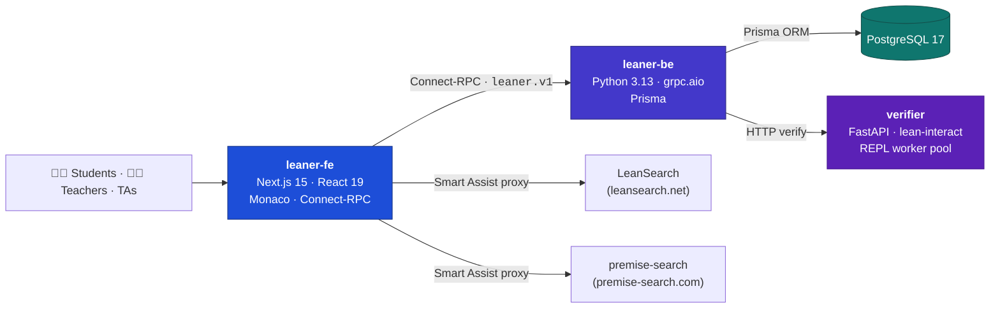

<div align="center">

**English** | [简体中文](README.zh-CN.md)


# Leaner

**An interactive learning platform for Lean 4 theorem proving — write proofs, get instant verification, and let AI suggest the next lemma.**

[](https://github.com/FlechazoLiu/ai4math-leaner-2.0/actions/workflows/lint.yaml)
[](LICENSE)
[](CONTRIBUTING.md)
[](https://lean-lang.org/)
[](https://github.com/leanprover-community/mathlib4)
[](https://nextjs.org/)
[](https://www.python.org/)

[Features](#-features) · [Screenshots](#-screenshots) · [Architecture](#%EF%B8%8F-architecture) · [Quick Start](#-quick-start) · [Documentation](#-documentation) · [Roadmap](#%EF%B8%8F-roadmap)


*The Playground: a scratchpad with live verification, proof-state inspection, and Smart Assist panels.*

</div>

---

## Why Leaner?

Teaching Lean 4 means wrestling with two things at once: the **mathematics** and the **toolchain**. Leaner removes the second problem. Students open a browser and get a full Lean 4 + [Mathlib](https://github.com/leanprover-community/mathlib4) environment with instant feedback; teachers get courses, assignments, automatic verification, and a grading workbench — all in one self-hostable platform.

Leaner is built for real classrooms and is developed and deployed in collaboration with the **AI4Math** initiatives at **Renmin University of China (RUC)** and **Peking University (PKU)**.

## ✨ Features

- 🔐 **Roles & permissions** — Admin, Teacher, Assistant, and Student roles with enrollment approval, per-course data boundaries, and self-service course discovery.
- 📚 **Courses & assignments** — A full course → assignment → question lifecycle. Each exercise carries both a natural-language statement (rendered with KaTeX) and its formal Lean 4 definition.
- ⚡ **Live Lean verification** — Proof code is checked by a pooled [lean-interact](https://github.com/leanDojo/lean-interact) REPL service, so students see `Verified` / `Sorry` / `Failed` states in seconds instead of waiting for a cold Mathlib build.
- 🧭 **Immersive answer editor** — A distraction-free [Monaco](https://microsoft.github.io/monaco-editor/) editor per question with autosaved drafts, draft restore, and separate formal (Lean) and informal (written) answers.
- 🤖 **Smart Assist** — Two AI research services, integrated side-by-side:
  - **Theorem Search** — search Mathlib theorems by natural-language description, powered by [LeanSearch](https://leansearch.net) (PKU AI4Math).
  - **In-State** — lemma recommendations from the *current proof state*, powered by [premise-search](https://premise-search.com) (RUC AI4Math).
- 🎮 **Playground** — A persistent scratchpad for experimenting with proofs, inspecting goal states, and trying out lemmas before an assignment.
- 📖 **Course resources** — Upload and share course materials; discussions support resource references.
- ✅ **Grading workbench** — A review queue for teachers/TAs with the student's code, verification status, score entry, and feedback, plus a per-course gradebook.
- 💬 **Discussions & notifications** — Threaded comments under questions and an in-app inbox to keep everyone in the loop.

## 📸 Screenshots

| | |
|---|---|
|  |  |
| **Answer editor** — full-screen editing with live verification | **In-State** — lemmas suggested from the current proof state |
|  |  |
| **Theorem Search** — find Mathlib lemmas in natural language | **Grading** — review submissions and give feedback |
|  |  |
| **Gradebook** — scores across a course | **Dashboard** — courses, assignments, and progress at a glance |

## 🏗️ Architecture

Four services, orchestrated by Docker Compose:



- **leaner-fe** (`:3000`) — server-rendered UI. Talks to the backend through typed Connect-RPC calls generated from the same Protobuf contracts.
- **leaner-be** (`:7720`) — all business logic behind gRPC services (`leaner.v1`), with PostgreSQL access via Prisma.
- **verifier** (`:8030`) — keeps resident Lean REPL workers alive (backed by `lean-interact`) so each verification skips Lean's cold-start; only reachable from the backend.
- **pg** — PostgreSQL 17 for users, courses, submissions, grades, and discussions.

## 🚀 Quick Start

> **Prerequisites**: Docker + Docker Compose, and [GNU Make](https://www.gnu.org/software/make/). For a native dev setup (Nix, pnpm, uv), see [docs/setup.md](docs/setup.md).

```bash
git clone https://github.com/FlechazoLiu/ai4math-leaner-2.0.git
cd ai4math-leaner-2.0

cp .env.example .env
# Edit .env: set POSTGRES_PASSWORD, AUTH_SECRET, and INITIAL_ADMIN_*

make init-services   # start PostgreSQL + backend + frontend
make up-verifier     # start the Lean verifier (see note below)
```

Then open **http://localhost:3000** and sign in with the `INITIAL_ADMIN_EMAIL` / `INITIAL_ADMIN_PASSWORD` you configured.

> **Verifier note** — the verifier runs its own Lean 4 + Mathlib environment and needs roughly **8 GB of RAM**. On smaller machines set `ENABLE_VERIFIER_PROFILE=false` and run the verifier elsewhere (see [docs/DEVOPS_GUIDE.md](docs/DEVOPS_GUIDE.md)). The first start downloads Mathlib artifacts and can take a while.

<details>
<summary><b>Configuration reference</b> (key variables in <code>.env</code>)</summary>

| Variable | Default | Description |
|---|---|---|
| `POSTGRES_PASSWORD` | — | Database password (**required**) |
| `AUTH_SECRET` | — | NextAuth session secret (**required**) |
| `NEXTAUTH_URL` | `http://localhost:3000` | Public URL of the frontend |
| `INITIAL_ADMIN_EMAIL` / `INITIAL_ADMIN_USERNAME` / `INITIAL_ADMIN_PASSWORD` | — | Bootstrap admin account created on first run |
| `LEAN_VERSION` / `MATHLIB4_VERSION` | `v4.22.0` | Lean and Mathlib versions used by the verifier |
| `WORKERS` | `1` | Number of resident Lean REPL workers |
| `REPO_URL_OR_PATH` | `/opt/mathlib4` | Mathlib checkout (URL or local path) used by the verifier |
| `ENABLE_VERIFIER_PROFILE` | `false` | Enable the verifier profile (recommended on 8 GB+ hosts) |
| `VERIFIER_MEM_LIMIT` / `VERIFIER_MEMSWAP_LIMIT` | `2g` / `4g` | Memory caps for the verifier container |
| `PG_IMAGE`, `LEANER_BE_IMAGE`, `LEANER_FE_IMAGE`, `VERIFIER_IMAGE` | `leaner/*` | Image tags (used for offline deployment) |

</details>

### 📦 Offline / air-gapped deployment

Build images with `make build-images`, transfer with `make export-images` / `make load-images`, and follow [docs/DEVOPS_GUIDE.md](docs/DEVOPS_GUIDE.md) — the guide covers the full on-server workflow including a 2 GB low-memory mode.

## 📚 Documentation

| Document | Description |
|---|---|
| [docs/setup.md](docs/setup.md) | Development environment (Compose or native dev loop) |
| [docs/DEVOPS_GUIDE.md](docs/DEVOPS_GUIDE.md) ([中文](docs/DEVOPS_GUIDE_ZH.md)) | Deployment, upgrades, backup, troubleshooting |
| [docs/STUDENT_GUIDE.md](docs/STUDENT_GUIDE.md) ([中文](docs/STUDENT_GUIDE_ZH.md)) | Student walkthrough: courses, assignments, submitting proofs |
| [docs/TA_GUIDE.md](docs/TA_GUIDE.md) ([中文](docs/TA_GUIDE_ZH.md)) | Teacher/TA walkthrough: grading, course management |
| [docs/SAMPLE_ASSIGNMENT.md](docs/SAMPLE_ASSIGNMENT.md) ([中文](docs/SAMPLE_ASSIGNMENT_ZH.md)) | Authoring an assignment end to end |
| [docs/feature_design.md](docs/feature_design.md) | Design notes ([PDF](docs/feature_design.pdf)) |
| [docs/website_design.md](docs/website_design.md) | Product design and roadmap notes |
| [USER_GUIDE.md](USER_GUIDE.md) | Quick end-user guide |

## 🗺️ Roadmap

- [ ] Multi-file playground workspaces and richer project scaffolds
- [ ] Friendlier diagnostics — localized, beginner-oriented Lean error explanations
- [ ] Proof similarity / plagiarism detection across submissions
- [ ] Gradebook analytics (difficulty, common failure points, cohort progress)
- [ ] Scale-out web IDE capabilities (collaboration, larger projects)

Ideas and contributions are welcome — see [Contributing](#-contributing).

## 🤝 Contributing

Issues and pull requests are welcome! See [CONTRIBUTING.md](CONTRIBUTING.md) for the development setup (`nix develop`, `make fmt / lint / proto`), commit conventions, and the PR workflow.

## 🔒 Security

Found a vulnerability? Please report it privately via [GitHub security advisories](https://github.com/FlechazoLiu/ai4math-leaner-2.0/security/advisories/new) — see [SECURITY.md](SECURITY.md).

## 📄 License

Released under the [MIT License](LICENSE).

## 🙏 Acknowledgments

- [LeanSearch](https://leansearch.net) — theorem search by **PKU AI4Math**, powering our Theorem Search panel
- [premise-search](https://premise-search.com) — premise selection by **RUC AI4Math**, powering our In-State panel
- [lean-interact](https://github.com/leanDojo/lean-interact) — the Lean 4 REPL toolchain behind our verifier
- [Mathlib](https://github.com/leanprover-community/mathlib4) and the Lean community for the incredible ecosystem
- Built with [Next.js](https://nextjs.org/), [Prisma](https://www.prisma.io/), [FastAPI](https://fastapi.tiangolo.com/), [Monaco Editor](https://microsoft.github.io/monaco-editor/), and [Connect-RPC](https://connectrpc.com/)

---

<div align="center">

<sub>Built with ❤️ for the Lean teaching community · 中文文档请见 <a href="README.zh-CN.md">README.zh-CN.md</a></sub>

</div>
