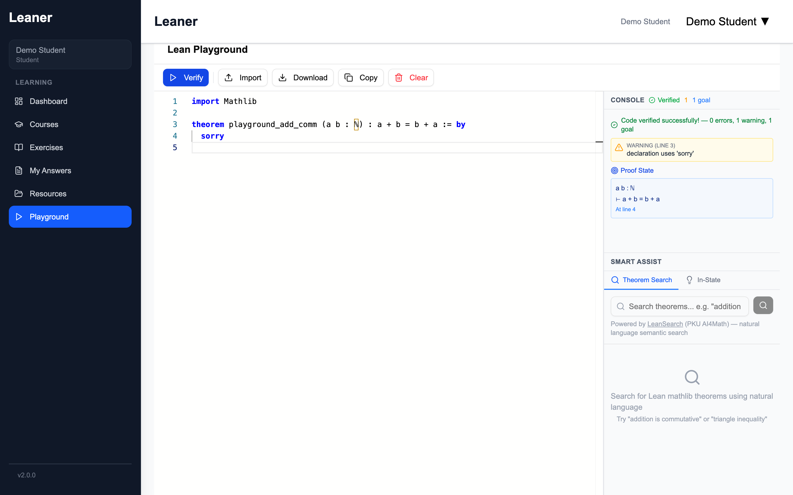
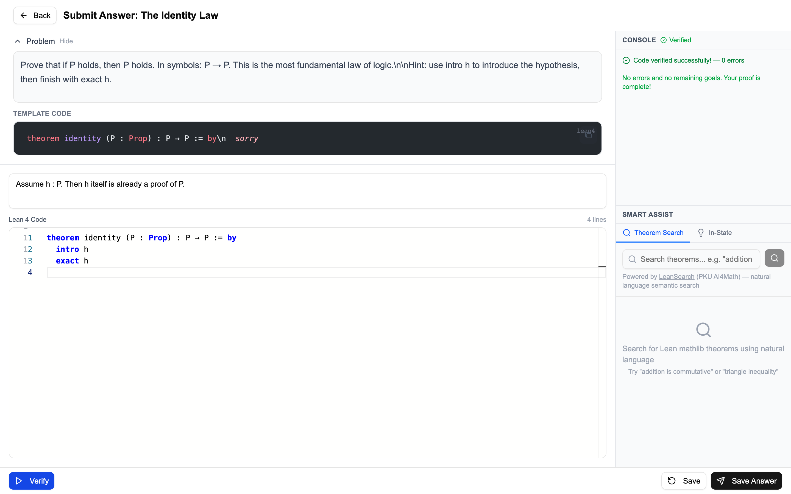
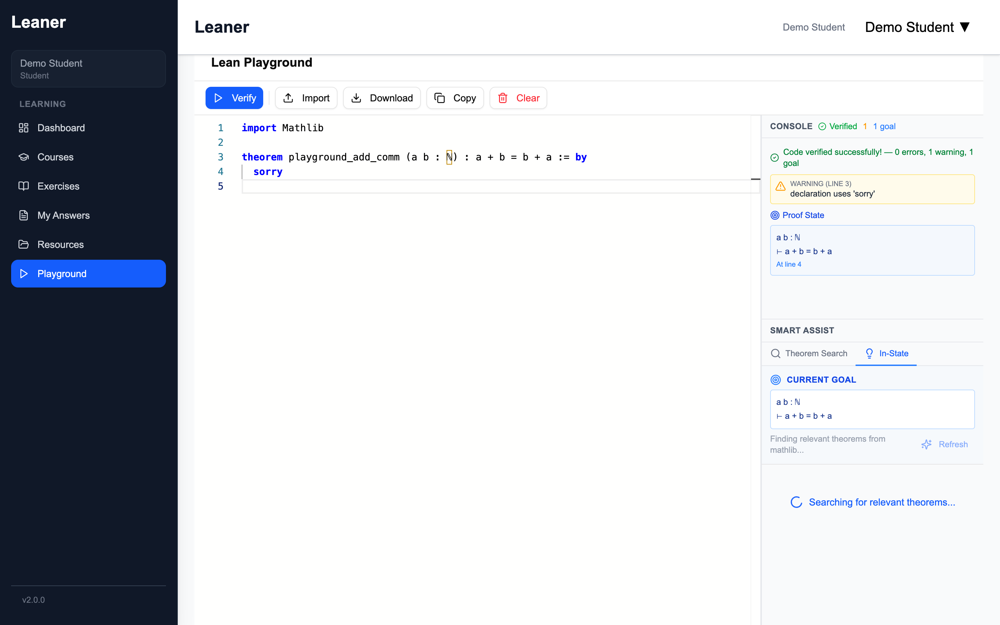
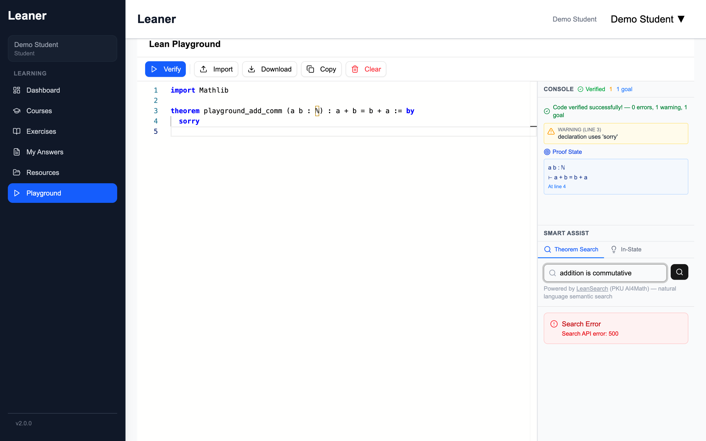
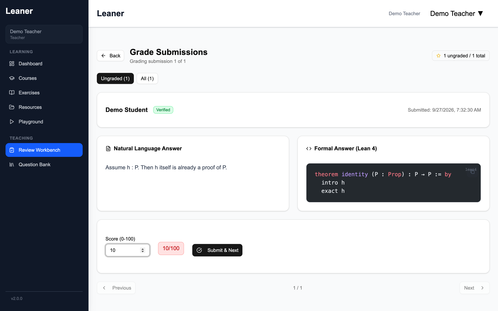
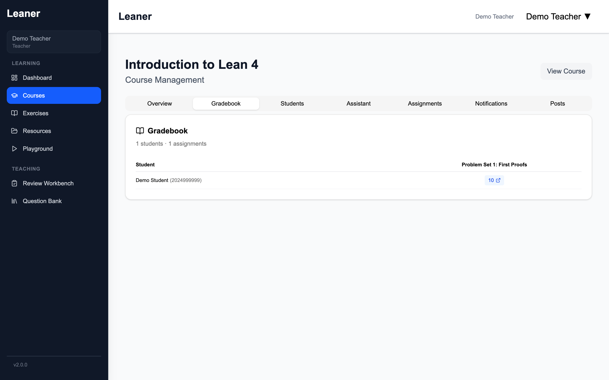
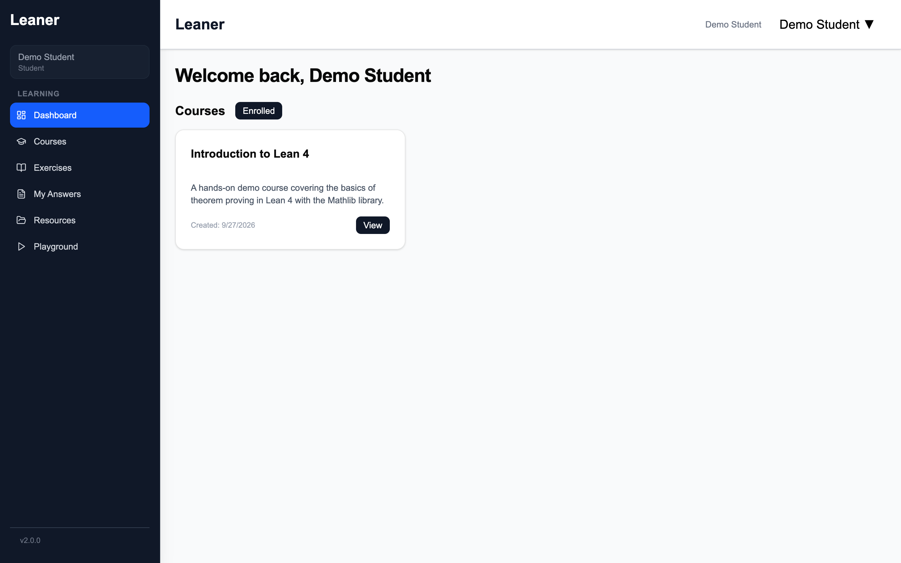
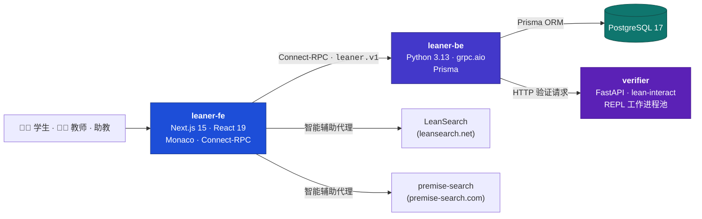

<div align="center">

[English](README.md) | **简体中文**


# Leaner

**基于 Lean 4 定理证明的互动式教学平台 —— 在浏览器中书写证明、即时验证，并由 AI 推荐下一个引理。**

[](https://github.com/FlechazoLiu/ai4math-leaner-2.0/actions/workflows/lint.yaml)
[](LICENSE)
[](CONTRIBUTING.md)
[](https://lean-lang.org/)
[](https://github.com/leanprover-community/mathlib4)
[](https://nextjs.org/)
[](https://www.python.org/)

[功能](#-功能) · [截图](#-截图) · [架构](#%EF%B8%8F-架构) · [快速开始](#-快速开始) · [文档](#-文档) · [路线图](#%EF%B8%8F-路线图)



*练习场（Playground）：支持实时验证、证明状态查看与智能辅助面板的草稿环境。*

</div>

---

## 为什么选择 Leaner？

教授 Lean 4 意味着同时与两件事搏斗：**数学本身**和**工具链**。Leaner 替你解决后者。学生打开浏览器即可获得完整的 Lean 4 + [Mathlib](https://github.com/leanprover-community/mathlib4) 环境与秒级反馈；教师则获得课程、作业、自动验证与批改工作台——全部集成于一个可私有部署的平台。

Leaner 面向真实课堂，由中国人民大学（RUC）与北京大学（PKU）的 **AI4Math** 团队协作开发与部署。

## ✨ 功能

- 🔐 **角色与权限** — 管理员、教师、助教、学生四种角色，含选课审批、按课程划分的数据边界与自助找课。
- 📚 **课程与作业** — 完整的 课程 → 作业 → 题目 生命周期。每道题目同时携带自然语言描述（KaTeX 渲染）与形式化 Lean 4 定义。
- ⚡ **Lean 实时验证** — 证明代码由 [lean-interact](https://github.com/leanDojo/lean-interact) REPL 常驻服务池校验，学生数秒内即可看到 `Verified` / `Sorry` / `Failed` 状态，无需等待 Mathlib 冷启动编译。
- 🧭 **沉浸式答题编辑器** — 每题一个全屏 [Monaco](https://microsoft.github.io/monaco-editor/) 编辑器，支持草稿自动保存与恢复，形式化（Lean）与非形式化（文字）作答分栏提交。
- 🤖 **智能辅助** — 两个 AI 科研服务并排集成：
  - **定理搜索** — 用自然语言检索 Mathlib 定理，由 [LeanSearch](https://leansearch.net)（北大 AI4Math）提供支持。
  - **In-State** — 基于**当前证明状态**推荐引理，由 [premise-search](https://premise-search.com)（人大 AI4Math）提供支持。
- 🎮 **练习场** — 持久化的证明草稿本，可随时查看目标状态、试验引理，再正式作答。
- 📖 **课程资源** — 上传与共享课程资料，讨论区支持引用资源。
- ✅ **批改工作台** — 面向教师/助教的待批队列，可查看学生代码与验证状态、打分并填写反馈，另含课程成绩册。
- 💬 **讨论与通知** — 题目下的树状评论，以及站内信箱，确保消息触达。

## 📸 截图

| | |
|---|---|
|  |  |
| **答题编辑器** — 全屏编辑与实时验证 | **In-State** — 依据当前证明状态推荐引理 |
|  |  |
| **定理搜索** — 用自然语言查找 Mathlib 定理 | **批改** — 审阅提交并给出反馈 |
|  |  |
| **成绩册** — 课程成绩总览 | **仪表盘** — 课程、作业与进度一览 |

## 🏗️ 架构

四个服务，由 Docker Compose 编排：



- **leaner-fe**（`:3000`）— 服务端渲染前端，通过同一套 Protobuf 契约生成的 Connect-RPC 类型化调用与后端通信。
- **leaner-be**（`:7720`）— 全部业务逻辑以 gRPC 服务（`leaner.v1`）暴露，经 Prisma 访问 PostgreSQL。
- **verifier**（`:8030`）— 维持常驻 Lean REPL 工作进程（基于 `lean-interact`），每次验证都免去 Lean 冷启动开销；仅接受后端调用。
- **pg** — PostgreSQL 17，存储用户、课程、提交、成绩与讨论。

## 🚀 快速开始

> **前置要求**：Docker + Docker Compose 与 [GNU Make](https://www.gnu.org/software/make/)。本地原生开发环境（Nix、pnpm、uv）请见 [docs/setup.md](docs/setup.md)。

```bash
git clone https://github.com/FlechazoLiu/ai4math-leaner-2.0.git
cd ai4math-leaner-2.0

cp .env.example .env
# 编辑 .env：设置 POSTGRES_PASSWORD、AUTH_SECRET 与 INITIAL_ADMIN_*

make init-services   # 启动 PostgreSQL + 后端 + 前端
make up-verifier     # 启动 Lean 验证器（见下方说明）
```

然后打开 **http://localhost:3000**，使用你配置的 `INITIAL_ADMIN_EMAIL` / `INITIAL_ADMIN_PASSWORD` 登录。

> **验证器说明** — 验证器运行独立的 Lean 4 + Mathlib 环境，大约需要 **8 GB 内存**。小内存机器可设置 `ENABLE_VERIFIER_PROFILE=false`，将验证器单独部署在其他主机（见 [docs/DEVOPS_GUIDE.md](docs/DEVOPS_GUIDE.md)）。首次启动需下载 Mathlib 产物，耗时较长。

<details>
<summary><b>配置参考</b>（<code>.env</code> 中的关键变量）</summary>

| 变量 | 默认值 | 说明 |
|---|---|---|
| `POSTGRES_PASSWORD` | — | 数据库密码（**必填**） |
| `AUTH_SECRET` | — | NextAuth 会话密钥（**必填**） |
| `NEXTAUTH_URL` | `http://localhost:3000` | 前端对外访问地址 |
| `INITIAL_ADMIN_EMAIL` / `INITIAL_ADMIN_USERNAME` / `INITIAL_ADMIN_PASSWORD` | — | 首次启动自动创建的管理员账号 |
| `LEAN_VERSION` / `MATHLIB4_VERSION` | `v4.22.0` | 验证器使用的 Lean 与 Mathlib 版本 |
| `WORKERS` | `1` | 常驻 Lean REPL 工作进程数 |
| `REPO_URL_OR_PATH` | `/opt/mathlib4` | 验证器使用的 Mathlib 仓库（URL 或本地路径） |
| `ENABLE_VERIFIER_PROFILE` | `false` | 启用验证器 profile（8 GB 以上主机建议开启） |
| `VERIFIER_MEM_LIMIT` / `VERIFIER_MEMSWAP_LIMIT` | `2g` / `4g` | 验证器容器内存上限 |
| `PG_IMAGE`、`LEANER_BE_IMAGE`、`LEANER_FE_IMAGE`、`VERIFIER_IMAGE` | `leaner/*` | 镜像标签（用于离线部署） |

</details>

### 📦 离线 / 内网部署

使用 `make build-images` 构建镜像，`make export-images` / `make load-images` 传输，并参照 [docs/DEVOPS_GUIDE.md](docs/DEVOPS_GUIDE.md) —— 指南覆盖完整的服务器部署流程，包括 2 GB 低内存模式。

## 📚 文档

| 文档 | 说明 |
|---|---|
| [docs/setup.md](docs/setup.md) | 开发环境搭建（Compose 或本地开发循环） |
| [docs/DEVOPS_GUIDE.md](docs/DEVOPS_GUIDE.md)（[中文](docs/DEVOPS_GUIDE_ZH.md)） | 部署、升级、备份与排障 |
| [docs/STUDENT_GUIDE.md](docs/STUDENT_GUIDE.md)（[中文](docs/STUDENT_GUIDE_ZH.md)） | 学生指南：选课、作业、提交证明 |
| [docs/TA_GUIDE.md](docs/TA_GUIDE.md)（[中文](docs/TA_GUIDE_ZH.md)） | 教师/助教指南：批改与课程管理 |
| [docs/SAMPLE_ASSIGNMENT.md](docs/SAMPLE_ASSIGNMENT.md)（[中文](docs/SAMPLE_ASSIGNMENT_ZH.md)） | 端到端创建一份作业的示例 |
| [docs/feature_design.md](docs/feature_design.md) | 设计文档（[PDF](docs/feature_design.pdf)） |
| [docs/website_design.md](docs/website_design.md) | 产品设计与路线图笔记 |
| [USER_GUIDE.md](USER_GUIDE.md) | 快速用户指南 |

## 🗺️ 路线图

- [ ] 多文件练习场工作区与更丰富的工程脚手架
- [ ] 更友好的诊断信息 —— 面向初学者的 Lean 错误中文化与解释
- [ ] 跨提交的证明相似度 / 查重检测
- [ ] 成绩册分析（难度分布、常见卡点、班级进度）
- [ ] 面向规模化 Web IDE 的能力（协作、更大工程）

欢迎提出想法与贡献 —— 见[贡献指南](#-贡献)。

## 🤝 贡献

欢迎 Issue 与 Pull Request！开发环境搭建（`nix develop`、`make fmt / lint / proto`）、提交规范与 PR 流程请见 [CONTRIBUTING.md](CONTRIBUTING.md)（英文）。

## 🔒 安全

发现安全漏洞？请通过 [GitHub 安全通告](https://github.com/FlechazoLiu/ai4math-leaner-2.0/security/advisories/new) 私下报告，详见 [SECURITY.md](SECURITY.md)。

## 📄 许可证

基于 [MIT License](LICENSE) 开源。

## 🙏 致谢

- [LeanSearch](https://leansearch.net) —— **北大 AI4Math** 的定理搜索，驱动定理搜索面板
- [premise-search](https://premise-search.com) —— **人大 AI4Math** 的前提选择，驱动 In-State 面板
- [lean-interact](https://github.com/leanDojo/lean-interact) —— 验证器背后的 Lean 4 REPL 工具链
- [Mathlib](https://github.com/leanprover-community/mathlib4) 与 Lean 社区的卓越生态
- 基于 [Next.js](https://nextjs.org/)、[Prisma](https://www.prisma.io/)、[FastAPI](https://fastapi.tiangolo.com/)、[Monaco Editor](https://microsoft.github.io/monaco-editor/) 与 [Connect-RPC](https://connectrpc.com/) 构建

---

<div align="center">

<sub>为 Lean 教学社区 ❤️ 构建 · English version: <a href="README.md">README.md</a></sub>

</div>
